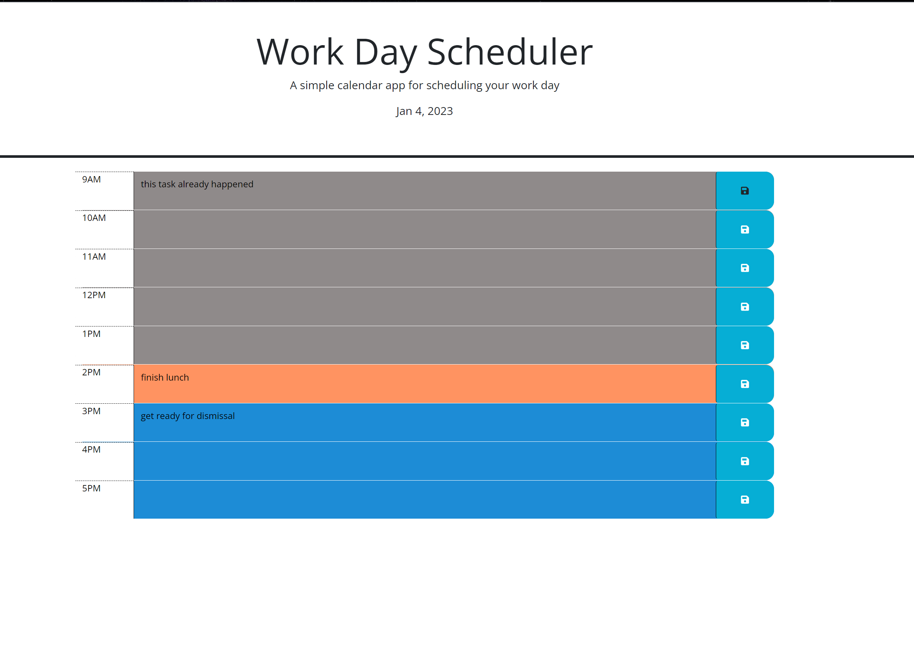

# Work-Day-Scheduler

## Description

This simple Work Day Scheduler will allow users to set up task they have for their 9 to 5 job. They will be able to put all their task within the time slots and save them. As the day passes the scheduler will change the time block background color to show if the task has now passed its given hour, if the task is in the current present hour or if its still for a future hour.

## User Story

This project came with started code that included linking to jquery, bootstrap as well as some fonts from google.

## Screenshots of the Deployed Project
Here is the Deployed page

Here is the local storage 

## Link to Deployed Project

https://chrisjg19.github.io/Work-Day-Scheduler/